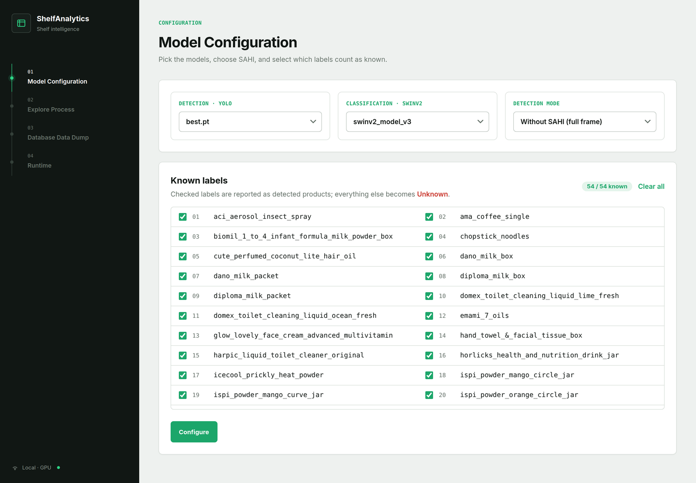
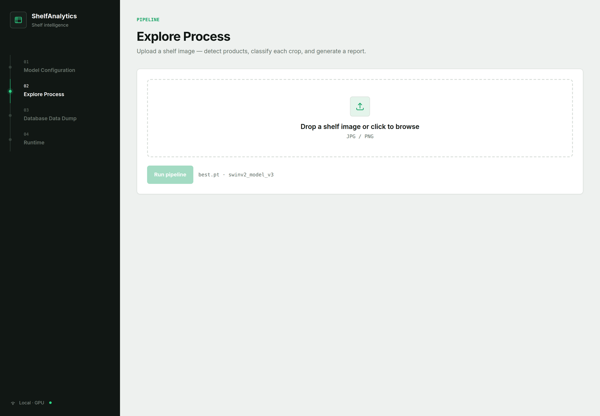
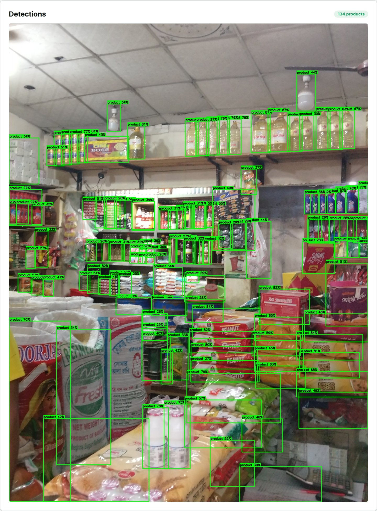
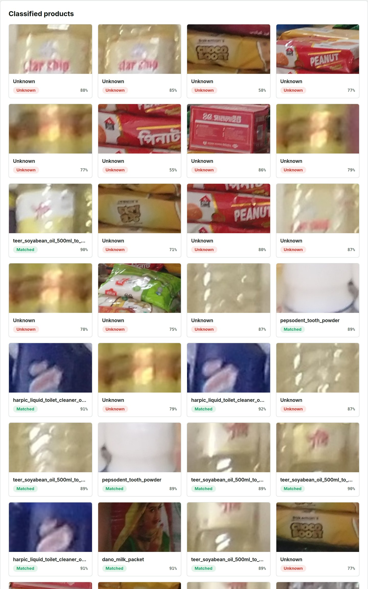
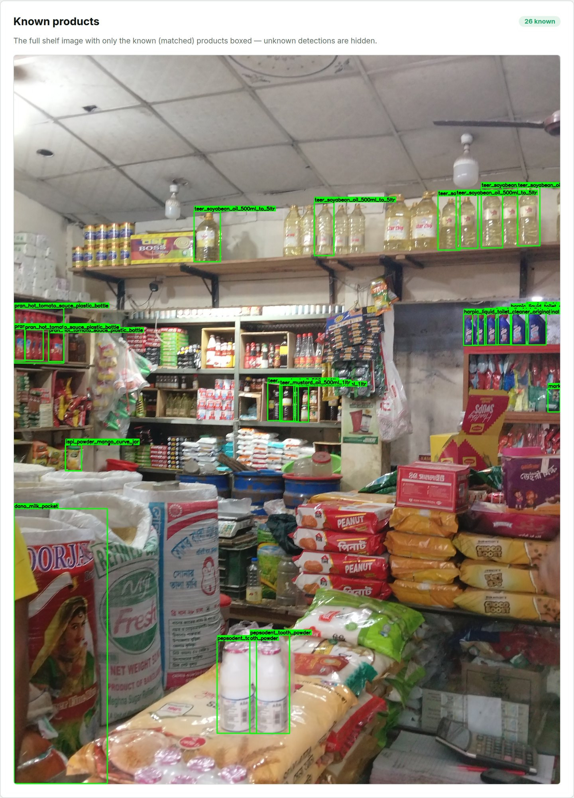
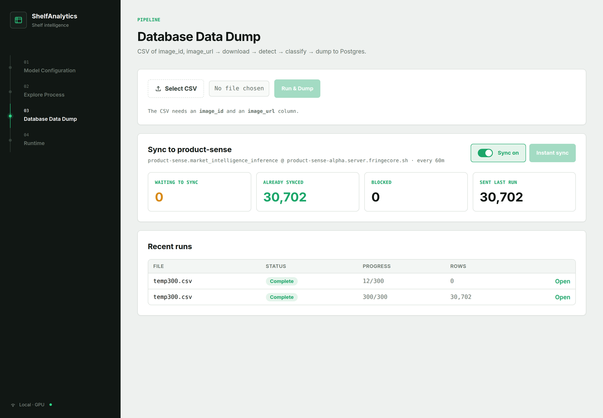
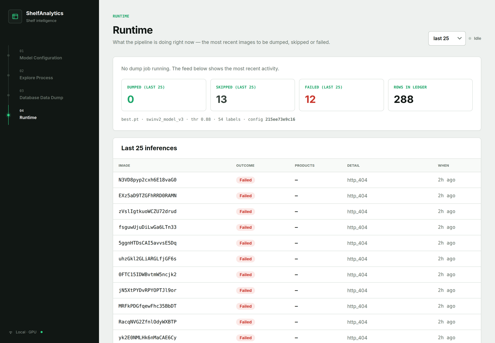

# ShelfAnalytics

Shelf analysis for mudi shops. It takes a shop shelf image, detects the products
in it with YOLO (optionally sliced with SAHI), classifies each crop with a local
SwinV2 model, and reports which SKUs are present. Crops below the confidence
threshold, or outside the configured label set, are reported as `Unknown`.

A FastAPI backend (API only) and a React + Vite frontend, run as two processes.

## Setup

Needs Python 3.10+, Node.js, PostgreSQL, and an NVIDIA GPU with CUDA.

**1. Database**

```bash
createdb -h localhost -U postgres shelf_analytics_db
psql -h localhost -U postgres -d shelf_analytics_db -v ON_ERROR_STOP=1 -f schema.sql
```

**2. Secrets**

```bash
cp backend/.env.example backend/.env    # DB_PASSWORD, and SYNC_DB_PASSWORD if syncing
```

**3. Model weights** — not in git, pull from Hugging Face into:

```
backend/models/yolo/best.pt
backend/models/swinv2/<model>/     # config.json, model.safetensors, preprocessor_config.json
```

**4. Backend** (port 8000)

```bash
pip install -r requirements.txt
cd backend && python run.py
```

**5. Frontend** (port 5173)

```bash
cd frontend && npm install && npm run dev
```

Open http://localhost:5173. API docs at http://127.0.0.1:8000/docs.

Optional — the remote sync runs as its own process:

```bash
cd backend && python sync_worker.py
```

## Pages

| Page | What it does |
| --- | --- |
| **Model Configuration** | Pick the YOLO weights and SwinV2 classifier, toggle SAHI, choose which labels count as known. |
| **Explore Process** | Upload one shelf image and watch it go through detect → classify. |
| **Database Data Dump** | Upload a CSV of `image_id, image_url`; the backend downloads, detects, classifies and writes rows to Postgres. Also holds the sync controls. |
| **Runtime** | Live feed of the last N images dumped, skipped or failed. |

## How it works

- **Images already done are skipped.** Each detection row records a `config_key`
  derived from the model file hashes, SAHI mode, thresholds and label selection.
  Re-running a CSV only processes what is genuinely new; change a model and
  everything is re-inferred.
- **Dumps survive restarts.** The job and its CSV rows are written to Postgres
  before the upload returns, and each image commits its detections and its
  "done" mark together. A reload, a crash or a power cut costs only the image in
  flight — the job resumes from the first unfinished row.
- **Sync to the remote.** `synced_at IS NULL` means a row has not been sent.
  `sync_worker.py` pushes those to the `product-sense` database on a schedule;
  the Data Dump page has an on/off toggle and an Instant sync button.

## Configuration

Environment variables, set in `backend/.env` — see `backend/app/config.py` for
the full list.

| Variable | Default | Purpose |
| --- | --- | --- |
| `DB_PASSWORD` | — | Local Postgres password. Required. |
| `SYNC_DB_PASSWORD` | — | Remote password. Without it the sync cannot run. |
| `PORT` | `8000` | Backend port. |
| `RELOAD` | `0` | Hot-reload. Off by default — a reload kills a running dump. |
| `USE_SAHI` | `1` | Default detection mode; the UI setting wins once saved. |
| `SWINV2_CONFIDENCE_THRESHOLD` | `0.88` | Below this a crop is `Unknown`. |
| `SYNC_INTERVAL_SECONDS` | `3600` | How often the sync worker runs. |

## Maintenance

```bash
cd backend
python -m app.maintenance sync-status      # sync backlog
python -m app.maintenance prepare-sync     # give older rows the id the sync needs
python -m app.maintenance create-indexes   # product_detections indexes, CONCURRENTLY
```

## Screens

### Model Configuration



### Explore Process



### Detections



### Classified products



### Known products



### Database Data Dump



### Runtime


